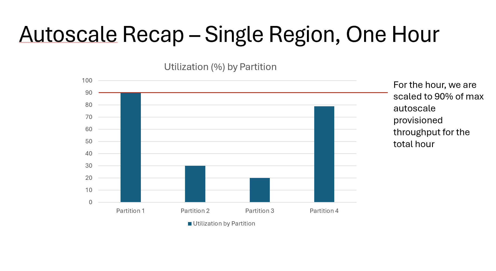
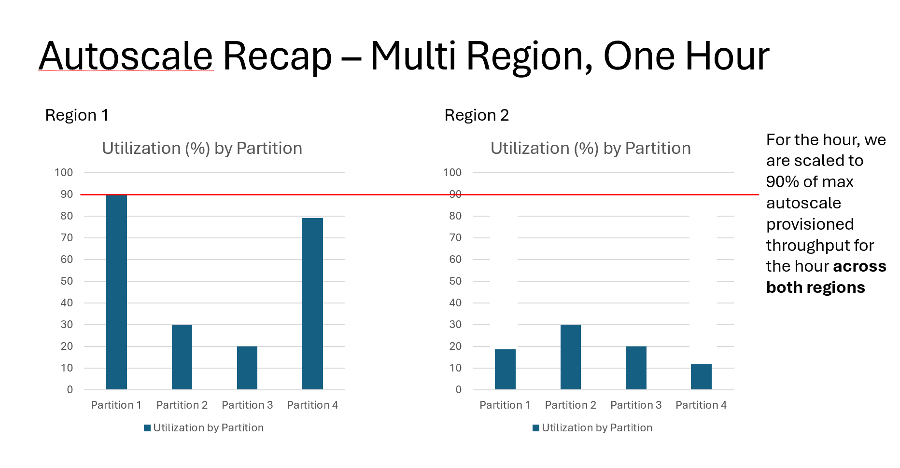
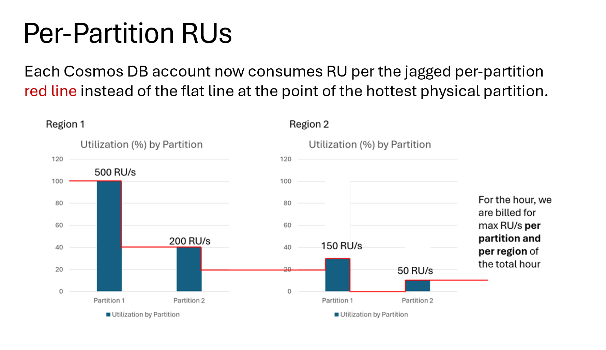

# Cosmos DB Topics - 2024/06/12

- **High Availability**, so more info on regions, zones, consistency mode VS OPR / OTR
- **Auditing Requests** sent to Cosmos DB
- **New feature: Per-Partition Per-Region Autoscale** (aka - "Autoscale V2")

---

## High availability

- Links:
  - https://learn.microsoft.com/en-us/azure/reliability/resiliency-recommendations/recommend-cosmos-db-nosql?tabs=graph
  - https://learn.microsoft.com/en-us/azure/reliability/reliability-cosmos-db-nosql

### Consistency Levels

- Links:
  - https://learn.microsoft.com/en-us/azure/cosmos-db/consistency-levels
  - https://learn.microsoft.com/en-us/azure/cosmos-db/nosql/how-to-manage-consistency

- Five Levels:
  - Strong
  - Bounded staleness
  - **Session* (default)
  - Consistent prefix
  - Eventual

Notes:
- Default consistency is defined at the Cosmos DB Account level
- Consistency levels have cost and performance implications
- Consistency can only be relaxed at the SDK instance or request level

### Availability Zones

- Links:
  - https://learn.microsoft.com/en-us/azure/reliability/reliability-cosmos-db-nosql#availability-zone-support

---

## Auditing Requests

**Use Azure Monitor** - for both monitoring (with alerts) and reporting

Configure Cosmos DB to sent its' telemetry to an Azure Monitor instance

- Links:
  - https://learn.microsoft.com/en-us/azure/cosmos-db/nosql/
  - https://learn.microsoft.com/en-us/azure/cosmos-db/monitor?tabs=resource-specific-diagnostics

Notes:
- The **Query Text** is excluded by default, but can be enable.
- **KQL (Kusto Query Language)** is a skill worth learning for DBAs, IMO
- New Book: The Definitive Guide to KQL
  - https://www.microsoftpressstore.com/store/definitive-guide-to-kql-using-kusto-query-language-9780138293383

  

---

## Per-Partition Per-Region Autoscale

  

---

  

---

  

