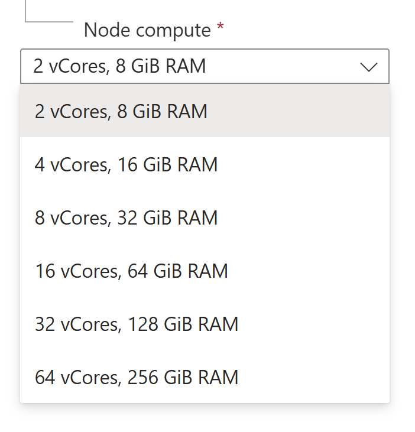
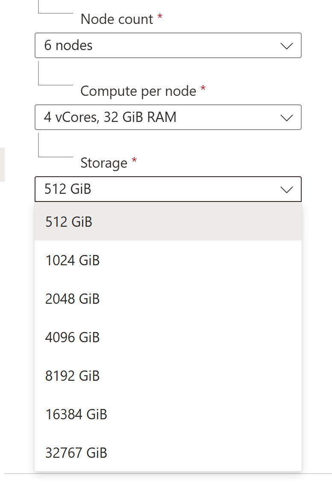

## Azure Cosmos DB PostgreSQL API - Notes

### Previous Questions

---

#### 1) Scale out vs Scale up guidance.

**For a Postgres workload, RAM is the key factor.**

In case of a distributed Postgres database, it’s about **aggregated RAM**, i.e. sum of RAM on all worker nodes. 

How exactly you should onfigure the cluster – less nodes with beefier configuration vs more nodes with smaller configuration – depends on your POC experiments for your specific workload.

Usually you **start with somewhat smaller spec for your cluster** than you believe is actually needed to **see if you can saturate it**.

**Then you observe what is exactly reaching 90-100% of utilization (e.g. compute) and scale up that part to repeat the performance runs.**

There's no universal rule or formula for all workloads.

References:
- [Pick initial size for cluster](https://learn.microsoft.com/en-us/azure/cosmos-db/postgresql/howto-scale-initial)

> "The vCore count is actually the only decision.
> RAM allocation is currently determined based on vCore count"

Configuration example from Azure Portal:

  

<pre>

</pre>

  

---

#### 2) Guidance on TPS expectations

**TPS very much depend on specific workload** and how good of a fit it is for distribution.

Usually performance PoC gives you an idea of what TPS you can reach with Azure Cosmos DB for PostgreSQL.

---

#### 3) Monitoring - Key metrics to guide them to scale up

You monitor **compute** and **storage** metrics (mostly) and **network bandwidth**
between the app and the cluster.

**When utlization reaches 90%, scale up.**

References:
- [View metrics](https://learn.microsoft.com/en-us/azure/cosmos-db/postgresql/howto-monitoring)
- [Create alerts on metrics](https://learn.microsoft.com/en-us/azure/cosmos-db/postgresql/howto-alert-on-metric)

---

#### 4) Monitoring - How to integrate with their preferred tooling - Promethius and Grafana

We don’t have integration guidance for these tools.

However, the documentation for these tools (Promethius, Grafana, etc.) for open-source
PostgreSQL and Citus should be a good starting point.

---

#### 5) Disks and storage - How many IOPS

IOPS on its own is not a reliable indicator in case of Azure Cosmos DB for PostgreSQL.

You’d rather want to run the **performance PoC** as described in #1 to understand what cluster configuration delivers proper performance.

The primary reason for it is that most workloads come from a single node (Postgres or non-Postgres) setup and IOPS in a single node configuration are not exactly the same as IOPs in a distributed Postgres DB. Once you determine the optimal cluster configuration for a workload, you can calculate aggregated IOPS on all worker nodes.

References:
- [Azure Cosmos DB for PostgreSQL compute and storage](https://learn.microsoft.com/en-us/azure/cosmos-db/postgresql/resources-compute)
- [Maximum IOPS for your compute / storage configuration](https://learn.microsoft.com/en-us/azure/cosmos-db/postgresql/resources-compute#maximum-iops-for-your-compute--storage-configuration)
---

#### 6) Guidance for initial scale settings

See 1) above.

---

#### Other Items

References:
- [Azure Cosmos DB for PostgreSQL documentation Home](https://learn.microsoft.com/en-us/azure/cosmos-db/postgresql/)
- [PostgreSQL extensions in Azure Cosmos DB for PostgreSQL](https://learn.microsoft.com/en-us/azure/cosmos-db/postgresql/reference-extensions)
- [Azure Cosmos DB for PostgreSQL limits](https://learn.microsoft.com/en-us/azure/cosmos-db/postgresql/reference-limits)
- [Azure Cosmos DB for PostgreSQL distributed SQL API](https://learn.microsoft.com/en-us/azure/cosmos-db/postgresql/reference-overview)
- [PgBouncer Connection pooling in Azure Cosmos DB for PostgreSQL](https://learn.microsoft.com/en-us/azure/cosmos-db/postgresql/concepts-connection-pool)
- [High availability in Azure Cosmos DB for PostgreSQL](https://learn.microsoft.com/en-us/azure/cosmos-db/postgresql/concepts-high-availability)
- [SLA](https://www.microsoft.com/licensing/docs/view/Service-Level-Agreements-SLA-for-Online-Services)

----

#### Citus

- https://docs.citusdata.com/en/v12.1/sharding/data_modeling.html
- https://docs.citusdata.com/en/v11.0/develop/api_metadata.html#coordinator-metadata
- https://docs.citusdata.com/en/v12.1/
- https://www.citusdata.com/faq
